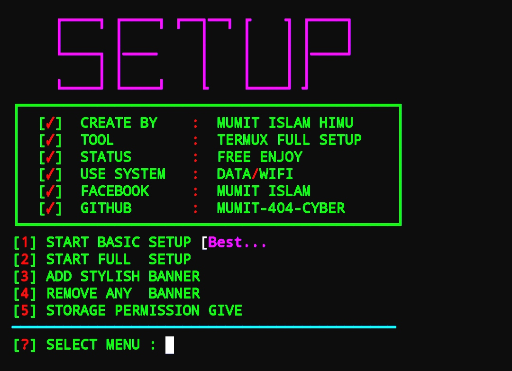

## COMMAND :

* `pkg update && pkg upgrade`

* `pkg install python`

* `pkg install git`

* `rm -rf T3RMUX-S3TUP `

* `git clone https://github.com/MUMIT-404-CYBER/T3RMUX-S3TUP.git `

* `cd T3RMUX-S3TUP`

* `python Setup.py`

___This Tools is Free Enjoy Dear User.___ 

## SCREENSHOT :
 

